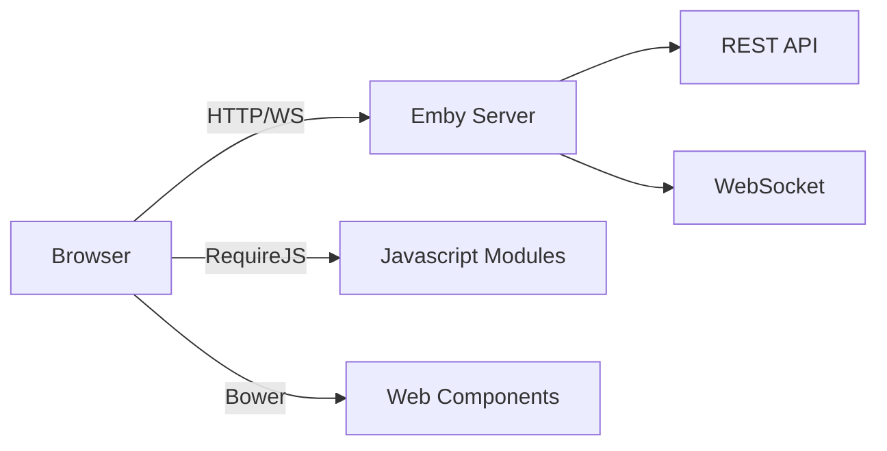

# ChezzyPufft Current Architecture

**Document ID:** ChezzyPufft-Current-Architecture
**Version:** 1.0
**Last Updated:** 2026-05-08
**Maintainer:** Mark LaPointe <mark@cloudbsd.org>
**Status:** ACTIVE
**Classification:** PUBLIC

---

## Source Architecture (Reference)

### Original WebUI Stack
- **Module System**: RequireJS (AMD)
- **Dependency Management**: Bower
- **UI Framework**: Vanilla JS + Custom Web Components
- **i18n**: Custom globalize.js
- **Routing**: page.js with hashbang

### Key Components
| Component | Purpose |
|-----------|---------|
| site.js | Main initialization, routing |
| dashboardpage.js | Admin dashboard |
| librarymenu.js | Navigation |
| itemdetailpage.js | Media item details |
| videoosd.js | Video player OSD |

### API Communication
- REST API via `emby-apiclient`
- WebSocket for real-time updates
- Server-sent events for notifications

---

## Architecture Diagram

---

## Limitations of Current Architecture
1. No TypeScript - fragile refactoring
2. No build system - poor optimization
3. No testing framework - low confidence
4. Global state - hard to reason about
5. AMD modules - outdated pattern

---

## Change Log

| Version | Date | Author | Changes |
|---------|------|--------|---------|
| 1.0 | 2026-05-08 | Mark LaPointe | Initial version |

**Last Updated:** 2026-05-08 12:00 UTC
**Contact:** mark@cloudbsd.org
**Classification:** PUBLIC
