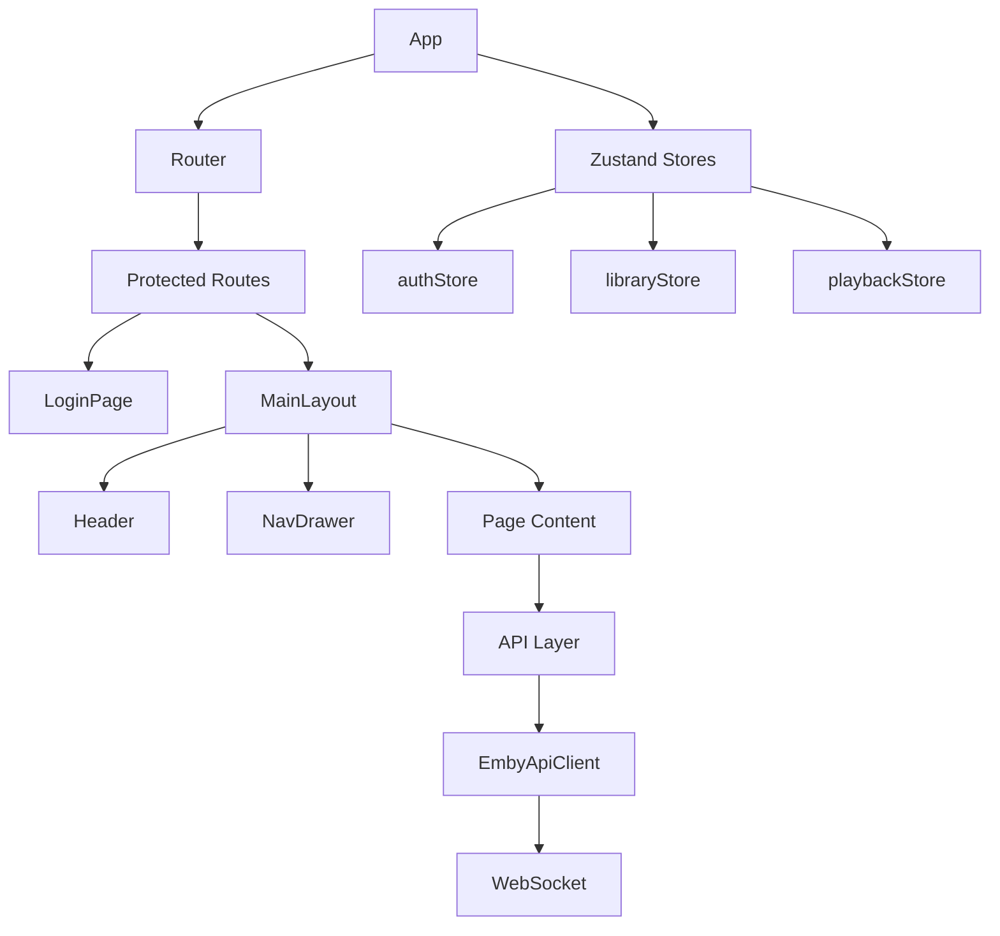

# ChezzyPufft Target Architecture

**Document ID:** ChezzyPufft-Architecture-Design
**Version:** 1.0
**Last Updated:** 2026-05-08
**Maintainer:** Mark LaPointe <mark@cloudbsd.org>
**Status:** ACTIVE
**Classification:** PUBLIC

---

## Target Architecture

### Modern Stack
| Layer | Technology |
|-------|------------|
| UI Framework | React 18 |
| Language | TypeScript (strict) |
| State | Zustand |
| Styling | Tailwind CSS |
| Build | Vite + PWA |
| Testing | Jest + RTL |

### Module Organization

---

## Key Design Decisions

### 1. API Client Wrapper
- Wrap `emby-apiclient` with TypeScript types
- Extend as needed for new functionality
- Maintain backward compatibility

### 2. Component Architecture
- Rewrite web components as React components
- Preserve contracts/behaviors exactly
- Maintain visual parity

### 3. State Management
- Zustand for global state
- React Query patterns for server state
- Local state for component-specific UI

### 4. Routing Strategy
- React Router v6
- Hashbang mode for SPA compatibility
- Lazy loading for route code splitting

---

## Performance Targets

| Metric | Target |
|--------|--------|
| First Contentful Paint | < 1.5s |
| Largest Contentful Paint | < 2.5s |
| Time to Interactive | < 3.5s |
| Bundle Size (initial) | < 200KB gzipped |
| Test Coverage | 100% |

---

## Change Log

| Version | Date | Author | Changes |
|---------|------|--------|---------|
| 1.0 | 2026-05-08 | Mark LaPointe | Initial version |

**Last Updated:** 2026-05-08 12:00 UTC
**Contact:** mark@cloudbsd.org
**Classification:** PUBLIC
